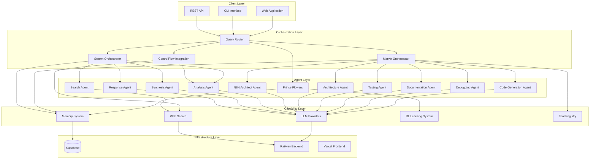
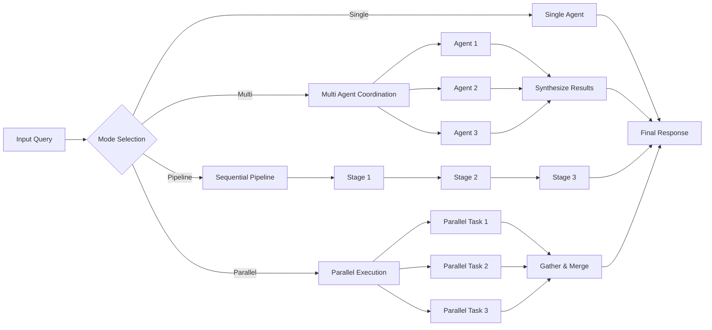
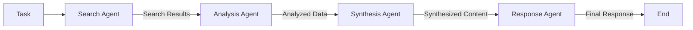
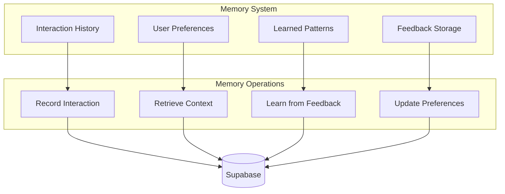
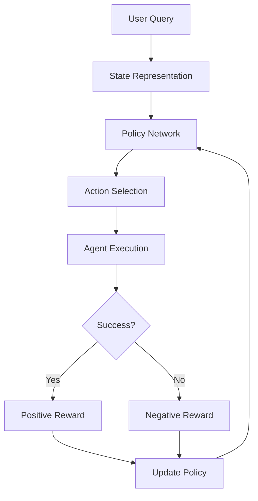
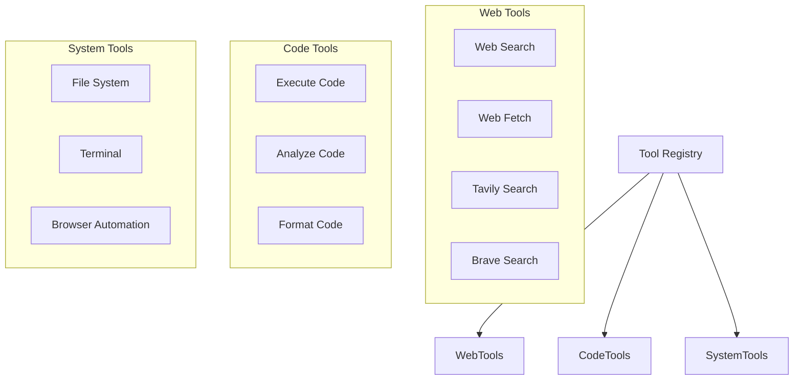
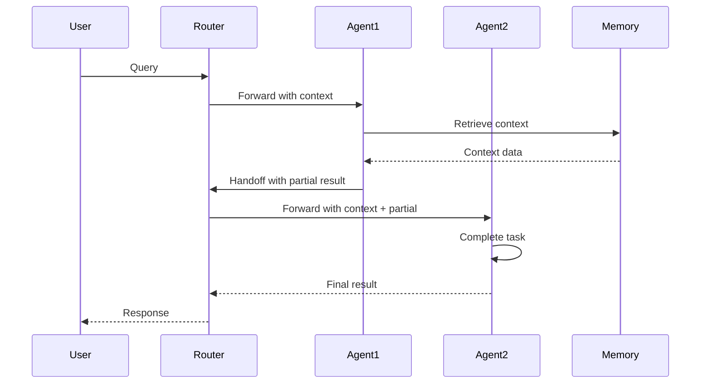
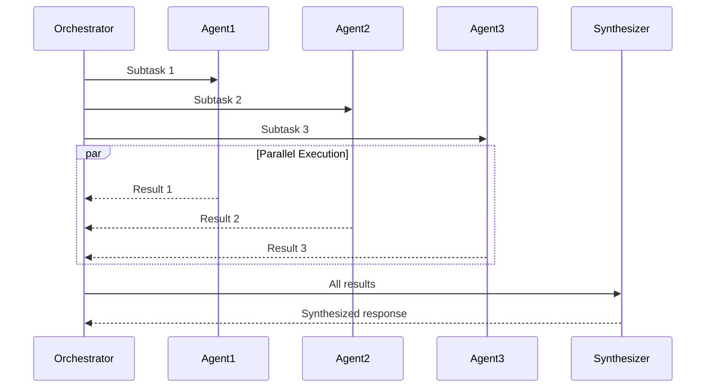
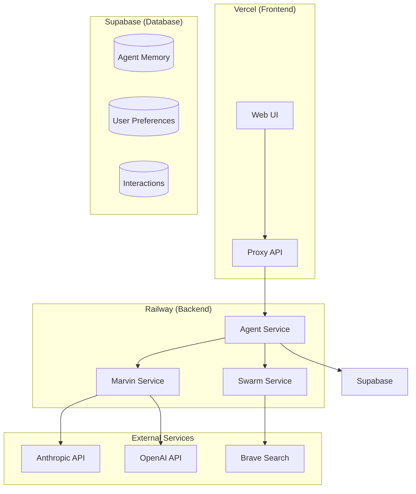

# Architecture Overview

## System Architecture

The TORQ Multi-Agent Orchestration System is built on a layered architecture that provides flexibility, scalability, and intelligence in agent coordination.

## High-Level Architecture



## Core Components

### 1. Query Router

The Query Router is the entry point for all agent requests. It uses AI-powered intent classification to determine the best agent or orchestrator for each request.

**Location:** `torq_console/agents/marvin_query_router.py`

**Key Responsibilities:**
- Intent classification
- Agent selection based on capabilities
- Routing decision logging
- Performance tracking

**Configuration:**
```python
from torq_console.agents import MarvinQueryRouter

router = MarvinQueryRouter(model="anthropic/claude-sonnet-4-20250514")

# Route a query
routing = await router.route_query("Help me debug this Python code")
# Returns: RoutingDecision with best_agent, capabilities, confidence
```

### 2. Marvin Orchestrator

The Marvin Orchestrator provides sophisticated multi-agent coordination using Marvin 3.0's agentic workflow capabilities.

**Location:** `torq_console/agents/marvin_orchestrator.py`

**Orchestration Modes:**

| Mode | Description | Use Case |
|------|-------------|----------|
| `SINGLE_AGENT` | Direct processing by one agent | Simple, focused tasks |
| `MULTI_AGENT` | Collaborative processing | Complex tasks requiring multiple perspectives |
| `PIPELINE` | Sequential processing | Multi-step workflows |
| `PARALLEL` | Concurrent execution | Independent subtasks |

**Architecture:**



### 3. Swarm Orchestrator

The Swarm Orchestrator implements swarm intelligence patterns for coordinated agent behavior, inspired by natural swarm systems and OpenAI Swarm.

**Location:** `torq_console/swarm/orchestrator.py`

**Agent Chain:**



**Key Features:**
- Natural agent handoffs
- Graceful degradation
- Timeout protection
- Execution history tracking

### 4. ControlFlow Integration

The ControlFlow Integration provides structured, type-safe agent orchestration using the ControlFlow framework.

**Location:** `torq_console/orchestration/integration.py`

**Available Agents:**
- Web Search Specialist
- Content Analyst
- Research Writer
- Code Specialist
- General Assistant

## Agent Memory System

The Agent Memory System provides persistent storage and retrieval of agent interactions, enabling context-aware responses and learning from feedback.



**Memory API:**

```python
from torq_console.agents import MarvinAgentMemory

memory = MarvinAgentMemory()

# Record an interaction
interaction_id = memory.record_interaction(
    user_input="How do I implement JWT?",
    agent_response="JWT implementation involves...",
    agent_name="prince_flowers",
    interaction_type="code_help",
    success=True
)

# Add feedback for learning
memory.add_feedback(interaction_id, score=0.9, feedback="Very helpful")

# Get context for new queries
context = memory.get_context("authentication", limit=5)
```

## RL Learning System

The Reinforcement Learning system enables agents to improve their performance through experience.

**Location:** `torq_console/agents/rl_learning_system.py`

**Components:**

| Component | Description |
|-----------|-------------|
| State Representation | Encodes query context and history |
| Action Space | Agent and strategy selections |
| Reward Function | Success/failure signals |
| Policy Network | Learns optimal decisions |

**Learning Flow:**



## Tool Registry

The Tool Registry manages available tools that agents can use to extend their capabilities.



## Communication Patterns

### Agent Handoff



### Multi-Agent Collaboration



## Deployment Architecture



## Performance Considerations

### Caching Strategy
- LLM responses cached by semantic hash
- Search results cached for 5 minutes
- Agent capabilities cached in memory

### Concurrency
- Multi-agent mode uses asyncio for parallel execution
- Maximum 10 concurrent agent operations
- Timeout protection (5 minutes per task)

### Scaling
- Stateless agent design enables horizontal scaling
- Connection pooling for external APIs
- Rate limiting to prevent API exhaustion
