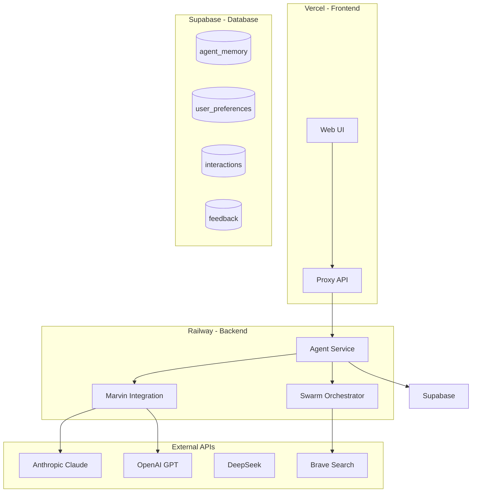

# Deployment Guide

This guide covers deploying the TORQ Multi-Agent Orchestration System to production using Railway and Supabase.

## Architecture Overview



---

## Prerequisites

- GitHub account with TORQ-CONSOLE repository
- Railway account (free tier available)
- Supabase account (free tier available)
- Vercel account (optional, for frontend)
- API keys for at least one LLM provider

---

## Railway Deployment

### Step 1: Create Railway Project

1. Go to [railway.app](https://railway.app)
2. Click "New Project" → "Deploy from GitHub repo"
3. Select your TORQ-CONSOLE repository
4. Railway will detect the Python project automatically

### Step 2: Configure Environment Variables

Add these environment variables in Railway:

```bash
# Required: LLM Provider (at least one)
ANTHROPIC_API_KEY=sk-ant-xxx
OPENAI_API_KEY=sk-xxx
DEEPSEEK_API_KEY=sk-xxx

# Optional: Web Search
BRAVE_SEARCH_API_KEY=xxx
TAVILY_API_KEY=tvly-xxx

# Supabase Connection
SUPABASE_URL=https://xxx.supabase.co
SUPABASE_SERVICE_KEY=eyJxxx...

# Railway Configuration
RAILWAY_ENVIRONMENT=production
TORQ_CONSOLE_PRODUCTION=true
```

### Step 3: Configure Service

Create a `railway.toml` file in your repository root:

```toml
[build]
builder = "NIXPACKS"

[deploy]
startCommand = "python -m uvicorn torq_console.railway_app:app --host 0.0.0.0 --port $PORT"
healthcheckPath = "/health"
healthcheckTimeout = 300
restartPolicyType = "ON_FAILURE"
restartPolicyMaxRetries = 10

[service]
name = "torq-console"
```

### Step 4: Deploy

1. Commit and push changes to GitHub
2. Railway will automatically deploy
3. Monitor deployment logs for any issues

### Step 5: Get Railway URL

After successful deployment, Railway will provide a URL like:
```
https://torq-console-production.up.railway.app
```

Copy this URL for the next steps.

---

## Supabase Setup

### Step 1: Create Supabase Project

1. Go to [supabase.com](https://supabase.com)
2. Click "New Project"
3. Set organization and project name
4. Set a strong database password
5. Choose a region close to your users

### Step 2: Get Connection Details

1. Go to Project Settings → API
2. Copy:
   - Project URL (`SUPABASE_URL`)
   - `anon` public key (for client-side)
   - `service_role` key (for server-side, keep secret!)

### Step 3: Create Database Tables

Run this SQL in the Supabase SQL Editor:

```sql
-- Agent Memory Table
CREATE TABLE IF NOT EXISTS agent_memory (
    id UUID PRIMARY KEY DEFAULT gen_random_uuid(),
    session_id TEXT NOT NULL,
    agent_name TEXT NOT NULL,
    interaction_type TEXT NOT NULL,
    user_input TEXT NOT NULL,
    agent_response TEXT NOT NULL,
    success BOOLEAN DEFAULT true,
    metadata JSONB DEFAULT '{}',
    created_at TIMESTAMPTZ DEFAULT NOW(),
    INDEX idx_session_id (session_id),
    INDEX idx_agent_name (agent_name),
    INDEX idx_created_at (created_at)
);

-- User Preferences Table
CREATE TABLE IF NOT EXISTS user_preferences (
    id UUID PRIMARY KEY DEFAULT gen_random_uuid(),
    user_id TEXT NOT NULL,
    preference_key TEXT NOT NULL,
    preference_value JSONB NOT NULL,
    updated_at TIMESTAMPTZ DEFAULT NOW(),
    UNIQUE(user_id, preference_key)
);

-- Feedback Table
CREATE TABLE IF NOT EXISTS feedback (
    id UUID PRIMARY KEY DEFAULT gen_random_uuid(),
    interaction_id UUID REFERENCES agent_memory(id),
    score FLOAT NOT NULL CHECK (score >= 0 AND score <= 1),
    feedback_text TEXT,
    created_at TIMESTAMPTZ DEFAULT NOW()
);

-- Performance Metrics Table
CREATE TABLE IF NOT EXISTS performance_metrics (
    id UUID PRIMARY KEY DEFAULT gen_random_uuid(),
    agent_name TEXT NOT NULL,
    metric_name TEXT NOT NULL,
    metric_value FLOAT NOT NULL,
    recorded_at TIMESTAMPTZ DEFAULT NOW()
);
```

### Step 4: Enable Row Level Security (RLS)

```sql
-- Enable RLS
ALTER TABLE agent_memory ENABLE ROW LEVEL SECURITY;
ALTER TABLE user_preferences ENABLE ROW LEVEL SECURITY;
ALTER TABLE feedback ENABLE ROW LEVEL SECURITY;

-- Create policies (adjust based on your auth setup)
CREATE POLICY "Users can view their own memory"
ON agent_memory FOR SELECT
USING (true);  -- Adjust for production auth

CREATE POLICY "Service role can insert memory"
ON agent_memory FOR INSERT
WITH CHECK (true);

CREATE POLICY "Service role can update memory"
ON agent_memory FOR UPDATE
WITH CHECK (true);
```

### Step 5: Update Railway Environment

Add Supabase credentials to Railway environment variables:

```bash
SUPABASE_URL=https://your-project.supabase.co
SUPABASE_SERVICE_KEY=eyJ...
```

---

## Vercel Frontend Deployment

### Step 1: Deploy Frontend

1. Go to [vercel.com](https://vercel.com)
2. Click "New Project" → Import from Git
3. Select TORQ-CONSOLE repository
4. Set root directory to `frontend/`
5. Configure build settings (if needed)

### Step 2: Configure Environment Variables

Add these in Vercel:

```bash
# Railway Backend URL
TORQ_BACKEND_URL=https://torq-console-production.up.railway.app

# Proxy Secret (generate a random string)
TORQ_PROXY_SHARED_SECRET=your-random-secret-string

# Optional: Direct LLM access (fallback)
ANTHROPIC_API_KEY=sk-ant-xxx
ANTHROPIC_MODEL=claude-sonnet-4-20250514
```

### Step 3: Configure Proxy Mode

The Vercel deployment operates in proxy mode:
- Static assets served from Vercel (fast)
- Agent requests proxied to Railway (full capabilities)
- Fallback to direct LLM calls if Railway unavailable

### Step 4: Deploy

1. Click "Deploy"
2. Vercel will build and deploy
3. Get your frontend URL

---

## Verification

### Health Checks

```bash
# Check Railway backend
curl https://torq-console-production.up.railway.app/health

# Check Vercel frontend
curl https://your-frontend.vercel.app/api/status

# Check Railway deployment fingerprint
curl https://torq-console-production.up.railway.app/api/debug/deploy
```

Expected response:

```json
{
  "status": "healthy",
  "service": "torq-console",
  "version": "0.91.0",
  "anthropic_configured": true,
  "supabase_connected": true
}
```

### Test Agent Integration

```bash
# Test chat endpoint
curl -X POST https://torq-console-production.up.railway.app/api/chat \
  -H "Content-Type: application/json" \
  -d '{"message": "Hello, TORQ!"}'
```

---

## Configuration Reference

### Environment Variables

| Variable | Required | Description | Example |
|----------|----------|-------------|---------|
| `ANTHROPIC_API_KEY` | Yes* | Anthropic API key | `sk-ant-xxx` |
| `OPENAI_API_KEY` | Yes* | OpenAI API key | `sk-xxx` |
| `DEEPSEEK_API_KEY` | No | DeepSeek API key | `sk-xxx` |
| `SUPABASE_URL` | Yes | Supabase project URL | `https://xxx.supabase.co` |
| `SUPABASE_SERVICE_KEY` | Yes | Supabase service role key | `eyJ...` |
| `BRAVE_SEARCH_API_KEY` | No | Brave Search API key | `BSxxx` |
| `TORQ_BACKEND_URL` | Vercel | Railway backend URL | `https://xxx.up.railway.app` |
| `TORQ_PROXY_SHARED_SECRET` | Vercel | Proxy authentication | `random-secret` |
| `TORQ_CONSOLE_PRODUCTION` | No | Enable production mode | `true` |

*At least one LLM API key is required.

### Scaling Configuration

Railway automatically scales based on load. Configure in `railway.toml`:

```toml
[scale]
minReplicas = 1
maxReplicas = 10
targetMemoryPercent = 80
targetCPUUtilization = 80
```

---

## Monitoring

### Railway Monitoring

1. Go to your Railway project
2. View metrics:
   - CPU usage
   - Memory usage
   - Request count
   - Response times

### Supabase Monitoring

1. Go to Supabase Dashboard
2. View:
   - Database size
   - Query performance
   - API request count
   - Row counts

### Custom Metrics

Access metrics via API:

```bash
curl https://torq-console-production.up.railway.app/api/metrics
```

Response:

```json
{
  "total_queries": 1500,
  "success_rate": 0.92,
  "avg_execution_time": 2.3,
  "agents_active": 11,
  "memory_items": 5000
}
```

---

## Troubleshooting

### Railway Deployment Issues

**Build fails:**
- Check Python version compatibility (3.11+)
- Verify all dependencies in requirements.txt
- Check build logs for specific errors

**Runtime errors:**
- Verify all environment variables are set
- Check Supabase connection
- Verify API keys are valid

### Supabase Connection Issues

**Connection refused:**
- Verify SUPABASE_URL is correct
- Check Supabase project is active
- Verify service role key

**Table not found:**
- Run SQL setup scripts in Supabase SQL Editor
- Verify tables were created
- Check table permissions

### Vercel Proxy Issues

**Proxy errors:**
- Verify TORQ_BACKEND_URL is correct
- Check Railway service is running
- Verify TORQ_PROXY_SHARED_SECRET matches

**Fallback mode active:**
- Indicates Railway is unreachable
- Check Railway service status
- Verify network connectivity

---

## Security Checklist

- [ ] Never commit `.env` files
- [ ] Use strong, unique API keys
- [ ] Enable RLS on Supabase tables
- [ ] Use service role key only server-side
- [ ] Set TORQ_PROXY_SHARED_SECRET
- [ ] Enable rate limiting
- [ ] Monitor for suspicious activity
- [ ] Regular security audits
- [ ] Keep dependencies updated

---

## Cost Optimization

### Free Tier Limits

| Service | Free Tier | Limits |
|---------|-----------|--------|
| Railway | $5 credit | Expires after 30 days |
| Supabase | 500MB DB | 50,000 MAU |
| Vercel | Hobby | 100GB bandwidth |

### Optimization Tips

1. **Enable caching** for repeated queries
2. **Use connection pooling** for database
3. **Set appropriate timeouts** for external APIs
4. **Monitor usage** to stay within free tiers
5. **Use cheaper LLMs** for simple tasks

---

## Production Checklist

- [ ] Railway deployment successful
- [ ] Supabase tables created
- [ ] Environment variables configured
- [ ] Health checks passing
- [ ] Agent integration tested
- [ ] Memory system verified
- [ ] Monitoring enabled
- [ ] Error logging configured
- [ ] Security measures in place
- [ ] Documentation updated
- [ ] Team trained on deployment
- [ ] Rollback plan documented
