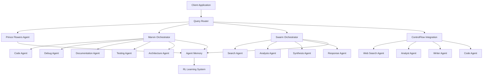

# TORQ Multi-Agent Orchestration System

## Overview

The TORQ Multi-Agent Orchestration System is a production-grade framework for coordinating multiple AI agents to solve complex tasks. Built on modern agent frameworks including Marvin 3.0, ControlFlow, and custom swarm intelligence patterns, TORQ enables sophisticated multi-agent workflows with intelligent routing, memory, and learning.

## Quick Start

```python
import asyncio
from torq_console.agents import MarvinAgentOrchestrator, OrchestrationMode
from torq_console.marvin_integration import TorqMarvinIntegration

async def main():
    # Create orchestrator
    orchestrator = MarvinAgentOrchestrator()

    # Process a query with multi-agent orchestration
    result = await orchestrator.process_query(
        "Research the latest AI developments and create a summary report",
        mode=OrchestrationMode.MULTI_AGENT
    )

    print(result.response)
    print(f"Agents used: {result.metadata['agents_used']}")

asyncio.run(main())
```

## Documentation

- [Architecture Overview](./01_architecture.md) - System design and component architecture
- [Agent Registry](./02_agent_registry.md) - Available agents and their capabilities
- [API Reference](./03_api_reference.md) - Complete API documentation with examples
- [Usage Guide](./04_usage_guide.md) - How to orchestrate multi-agent workflows
- [Deployment Guide](./05_deployment.md) - Railway and Supabase setup instructions

## Key Features

### Intelligent Query Routing
- Automatic intent classification
- Capability-based agent selection
- Context-aware routing decisions
- Performance metric tracking

### Multiple Orchestration Modes
- **Single Agent**: Direct processing by one specialized agent
- **Multi-Agent**: Collaborative processing by multiple agents
- **Pipeline**: Sequential agent processing
- **Parallel**: Concurrent agent execution with result synthesis

### Persistent Memory & Learning
- Conversation history tracking
- User preference learning
- Pattern extraction from feedback
- Context provision for agents

### Specialized Workflow Agents
- Code Generation
- Debugging
- Documentation
- Testing
- Architecture Design
- N8N Workflow Architect

## Architecture



## Installation

```bash
# Install TORQ Console with agent support
pip install torq-console[agents]

# Or install from source
cd TORQ-CONSOLE
pip install -e .
```

## Configuration

Set up your environment variables:

```bash
# Required: At least one LLM provider
export ANTHROPIC_API_KEY=your_key_here  # Recommended
# OR
export OPENAI_API_KEY=your_key_here

# Optional: Additional providers
export DEEPSEEK_API_KEY=your_key_here
export XAI_API_KEY=your_key_here

# Optional: Web search
export BRAVE_SEARCH_API_KEY=your_key_here
export TAVILY_API_KEY=your_key_here
```

## Version

Current Version: **0.91.0**

## License

Copyright (c) 2025 TORQ Console. All rights reserved.
